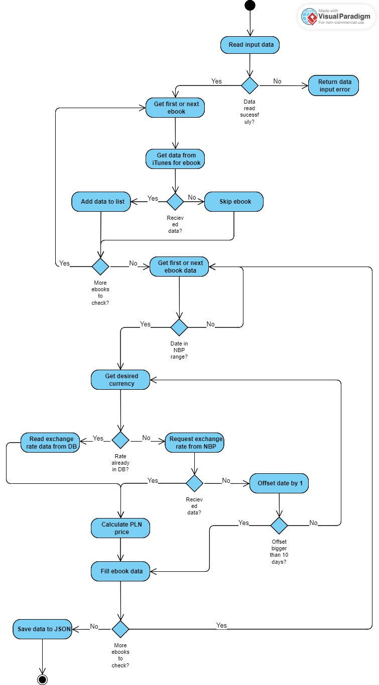

# Ebook Price Converter
Ebook Price Converter is a program that gets data about ebooks from iTunes API and converts their prices to Polish zloty (PLN) according to exchange rates from the National Bank of Poland (NBP).

## Requirements

To run the program, you need:

- Python 3.8 or higher
- Libraries: pandas, requests and tqdm
- A csv file with a list of ebooks to check in the format: author, title (example list is provided)

## Installation

To install the program, clone this repository and install the required dependencies:

```bash
git clone https://github.com/zapalke/ebook_price_converter.git
cd ebook_price_converter
pip install -r requirements.txt
```

## Usage
To run the program you have to provide path to the source list and path where results should be saved. Optionally you can also provide from which country should the iTunes results be.
You can either edit the code or run it direclty from **cmd** using this command:
```console
python ebook_price_converter.py <list of ebooks>.csv <results>.json <country code; defauld US>
```
As a result you will get a JSON file with given structure:
```json
[
  {
    "name": "Andrzej Sapkowski & Danusia Stok",
    "title": "The Last Wish",
    "curr": "USD",
    "price": 9.99,
    "date": "2008-12-14",
    "fromNBP": {
      "rate": 2.9709,
      "pricePLN": 29.679291,
      "tableNo": "243/A/NBP/2008"
    }
  },
  {
    "name": "Agatha Christie",
    "title": "The Mysterious Affair at Styles",
    "curr": "USD",
    "price": 0,
    "date": "2008-07-27",
    "fromNBP": {
      "rate": 2.042,
      "pricePLN": 0,
      "tableNo": "145/A/NBP/2008"
    }
  },
```

## How the app works

The process behind app has 4 stages:
1. Read data and check for errors
2. Request data from iTunes API and save it
3. For each ebook, try to find data from NBP. It has several conditions
     1. Release date must be after 2002-01-02, because this is the earliest rate available in NBP API
     2. If data for a given data has been previously requested, it should be saved in *exchange_rates.csv*, so the script will first look there
     3. If the request to API returns code 403, the script will try to look for the closest possible exchange rate from up to 10 days before.
4. Save data in JSON format.
This script can be represented by the following activity diagram.
